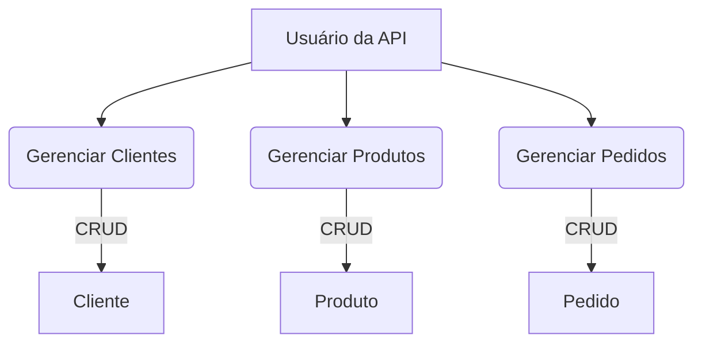

# CENTRO UNIVERSITÁRIO INTERNACIONAL UNINTER

## DESENVOLVIMENTO WEB BACK END

### ATIVIDADE PRÁTICA

### 2026

---

# ATIVIDADE PRÁTICA

## 1. Descrição de uma situação fictícia

A **Baozi Store** é uma pequena loja que vende pão chinês. Para melhorar a organização do negócio, foi criado um sistema simples para controlar clientes, produtos e pedidos. Um cliente chamado **DiegoSilva4751079** realizou seu cadastro no sistema. O produto vendido pela loja chama-se **Pão Chinês Tradicional** e é vendido por **R$ 15,50**. Em um determinado momento, o cliente realizou um pedido de **5** unidades do produto. O sistema registra o cliente, o produto comprado e a quantidade solicitada, facilitando o controle da loja.

---

## 2. Diagrama de Caso de Uso



**Descrição:**

O diagrama de caso de uso acima ilustra as funcionalidades principais da API REST da Baozi Store. O **Usuário da API** (ator principal) interage com o sistema para **Gerenciar Clientes**, **Gerenciar Produtos** e **Gerenciar Pedidos**. Cada uma dessas funcionalidades envolve operações CRUD (Create, Read, Update, Delete) sobre as respectivas entidades.

---

## 3. Especificação da API desenvolvida

A API REST da Baozi Store foi desenvolvida utilizando **Java** com **Spring Boot**, seguindo o padrão de arquitetura **MVC (Model-View-Controller)**. Para persistência de dados, foi empregado o **Spring Data JPA** com um banco de dados em memória **H2** para desenvolvimento e testes, sendo compatível com **MySQL** ou **MariaDB** para ambientes de produção. Os endpoints retornam dados no formato **JSON**.

### Entidades Criadas:

#### **Cliente**

| Campo        | Tipo       | Descrição                               |
| :----------- | :--------- | :-------------------------------------- |
| `id`         | `Long`     | Identificador único do cliente          |
| `nome`       | `String`   | Nome completo do cliente                |
| `clienteDesde` | `LocalDate` | Data de cadastro do cliente             |

#### **Produto**

| Campo    | Tipo        | Descrição                               |
| :------- | :---------- | :-------------------------------------- |
| `id`     | `Long`      | Identificador único do produto          |
| `nome`   | `String`    | Nome do produto                         |
| `preco`  | `BigDecimal` | Preço unitário do produto               |
| `estoque` | `Boolean`   | Indica se o produto está em estoque     |

#### **Pedido**

| Campo        | Tipo      | Descrição                               |
| :----------- | :-------- | :-------------------------------------- |
| `id`         | `Long`    | Identificador único do pedido           |
| `clienteId`  | `Long`    | ID do cliente que realizou o pedido     |
| `produtoId`  | `Long`    | ID do produto solicitado no pedido      |
| `quantidade` | `Integer` | Quantidade do produto no pedido         |

### Endpoints Implementados:

#### **Endpoints para Cliente (`/clientes`)**

| Método | URL             | Descrição                               |
| :----- | :-------------- | :-------------------------------------- |
| `POST` | `/clientes`     | Cria um novo cliente                    |
| `GET`  | `/clientes`     | Lista todos os clientes                 |
| `GET`  | `/clientes/{id}` | Consulta um cliente pelo ID             |
| `PUT`  | `/clientes/{id}` | Atualiza um cliente existente pelo ID   |
| `DELETE` | `/clientes/{id}` | Exclui um cliente pelo ID               |

#### **Endpoints para Produto (`/produtos`)**

| Método | URL             | Descrição                               |
| :----- | :-------------- | :-------------------------------------- |\n| `POST` | `/produtos`     | Cria um novo produto                    |
| `GET`  | `/produtos`     | Lista todos os produtos                 |
| `GET`  | `/produtos/{id}` | Consulta um produto pelo ID             |
| `PUT`  | `/produtos/{id}` | Atualiza um produto existente pelo ID   |
| `DELETE` | `/produtos/{id}` | Exclui um produto pelo ID               |

#### **Endpoints para Pedido (`/pedidos`)**

| Método | URL             | Descrição                               |
| :----- | :-------------- | :-------------------------------------- |
| `POST` | `/pedidos`      | Cria um novo pedido                     |
| `GET`  | `/pedidos`      | Lista todos os pedidos                  |
| `GET`  | `/pedidos/{id}` | Consulta um pedido pelo ID              |
| `PUT`  | `/pedidos/{id}` | Atualiza um pedido existente pelo ID    |
| `DELETE` | `/pedidos/{id}` | Exclui um pedido pelo ID                |

---

## 4. Prints do Postman

### Testes da API Baozi Store

#### **1. POST - Criar Cliente**

**Request:**
```
POST http://localhost:8080/clientes
Content-Type: application/json

{
  "nome": "DiegoSilva4751079",
  "clienteDesde": "2024-01-15"
}
```

**Response (Status 201):**
```json
{
  "id": 1,
  "nome": "DiegoSilva4751079",
  "clienteDesde": "2024-01-15"
}
```

#### **2. POST - Criar Produto**

**Request:**
```
POST http://localhost:8080/produtos
Content-Type: application/json

{
  "nome": "Pão Chinês Tradicional",
  "preco": 15.50,
  "estoque": true
}
```

**Response (Status 201):**
```json
{
  "id": 1,
  "nome": "Pão Chinês Tradicional",
  "preco": 15.5,
  "estoque": true
}
```

#### **3. POST - Criar Pedido**

**Request:**
```
POST http://localhost:8080/pedidos
Content-Type: application/json

{
  "clienteId": 1,
  "produtoId": 1,
  "quantidade": 5
}
```

**Response (Status 201):**
```json
{
  "id": 1,
  "clienteId": 1,
  "produtoId": 1,
  "quantidade": 5
}
```

#### **4. GET - Listar Todos os Clientes**

**Request:**
```
GET http://localhost:8080/clientes
```

**Response (Status 200):**
```json
[
  {
    "id": 1,
    "nome": "DiegoSilva4751079",
    "clienteDesde": "2024-01-15"
  }
]
```

#### **5. GET - Consultar Cliente por ID**

**Request:**
```
GET http://localhost:8080/clientes/1
```

**Response (Status 200):**
```json
{
  "id": 1,
  "nome": "DiegoSilva4751079",
  "clienteDesde": "2024-01-15"
}
```

#### **6. GET - Listar Todos os Produtos**

**Request:**
```
GET http://localhost:8080/produtos
```

**Response (Status 200):**
```json
[
  {
    "id": 1,
    "nome": "Pão Chinês Tradicional",
    "preco": 15.5,
    "estoque": true
  }
]
```

#### **7. GET - Consultar Produto por ID**

**Request:**
```
GET http://localhost:8080/produtos/1
```

**Response (Status 200):**
```json
{
  "id": 1,
  "nome": "Pão Chinês Tradicional",
  "preco": 15.5,
  "estoque": true
}
```

#### **8. GET - Listar Todos os Pedidos**

**Request:**
```
GET http://localhost:8080/pedidos
```

**Response (Status 200):**
```json
[
  {
    "id": 1,
    "clienteId": 1,
    "produtoId": 1,
    "quantidade": 5
  }
]
```

#### **9. GET - Consultar Pedido por ID**

**Request:**
```
GET http://localhost:8080/pedidos/1
```

**Response (Status 200):**
```json
{
  "id": 1,
  "clienteId": 1,
  "produtoId": 1,
  "quantidade": 5
}
```

#### **10. DELETE - Deletar Cliente**

**Request:**
```
DELETE http://localhost:8080/clientes/1
```

**Response (Status 204):**
```
No Content
```

#### **11. GET - Verificar Listagem Após Delete**

**Request:**
```
GET http://localhost:8080/clientes
```

**Response (Status 200):**
```json
[]
```

---

## 5. Link do repositório (GitHub ou similar) contendo o projeto(código fonte)

O código-fonte completo do projeto deve ser enviado para um repositório GitHub (ou similar) a ser criado pelo aluno. O link abaixo é um exemplo e deve ser substituído pelo link real do seu repositório:

[https://github.com/SEU_USUARIO/baozi-store](https://github.com/SEU_USUARIO/baozi-store)

---

## Referências

[1] UNINTER. **TRABALHO DE DESENVOLVIMENTO WEB BACK-END - API REST – Baozi Store**. Atividade Prática. 2026.
[2] UNINTER. **ATIVIDADE PRÁTICA - MODELO**. Documento de Modelo. 2025.
